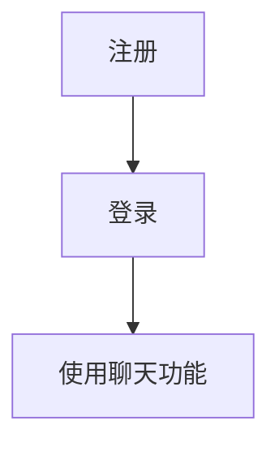

# IM

## 前置条件
### 准备以下环境
1. `Node.js` 前端界面所需
2. `Golang` 后端运行环境
3. `MongoDB` 存储用户信息
4. `Redis` 存储聊天记录

### 准备数据
#### MongoDB
1. 在MongoDB数据库创建`im`数据库, 如果你想自定义数据库名, 则需要修改
2. 找到项目根目录下`example`的`sql`目录四个文件
3. 对`room_basic`表进行插入数据
    ```mongodb
    use im
    db.room_basic.insertMany(<room_basic.json的数据>)
    ```
4. 对`user_basic`表进行插入数据
    ```mongodb
    use im
    db.user_basic.insertMany(<user_basic.json的数据>)
    ```
5. 对`user_room`表进行插入数据
    ```mongodb
    use im
    db.user_room.insertMany(<user_room.json的数据>)
    ```
6. 找到项目根目录下`config`目录的`db.yaml`的`Mongodb`对象,修改位你的`Mongodb`数据库的信息
- username: 数据库的账号(如果设置了)
- password: 数据库的密码(如果设置了)
- url: 数据库的`URL`地址

### Redis
1. 找到项目根目录下`config`目录的`db.yaml`的`Mongodb`对象,修改位你的`Mongodb`数据库的信息
- password: 数据库的密码(如果设置了)
- url: 数据库的`URL`地址

## 使用

### 基本流程

